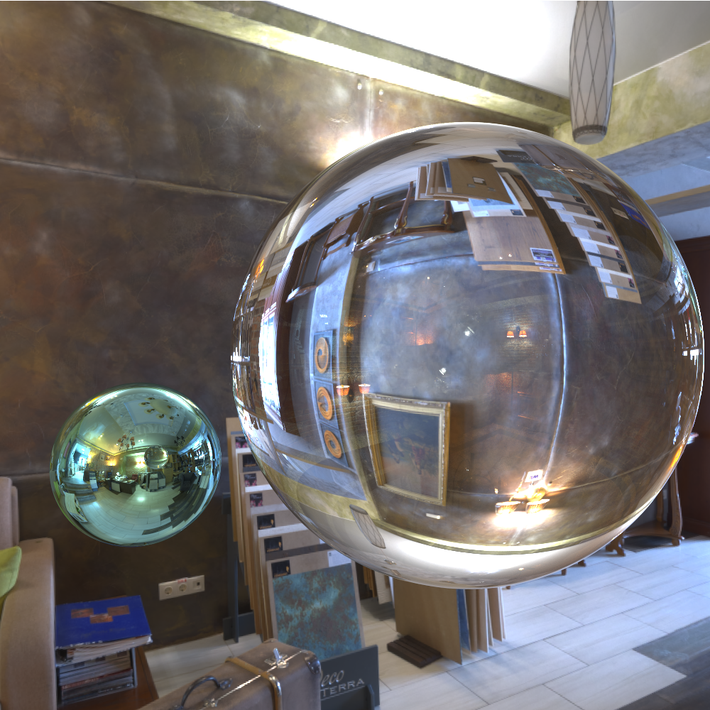

# Izpi

A path tracer implemented in Golang built on top of [Peter Shirley's Raytracing books](https://raytracing.github.io).

Currently supports:

* Rendering into a float64 image buffer.
* Image-based lighting.
* Primitives: Spheres, boxes, rectangles and triangles.
* Materials: Glass, metal, Lambert, Perlin noise.
* Textures: LDR and HDR.

