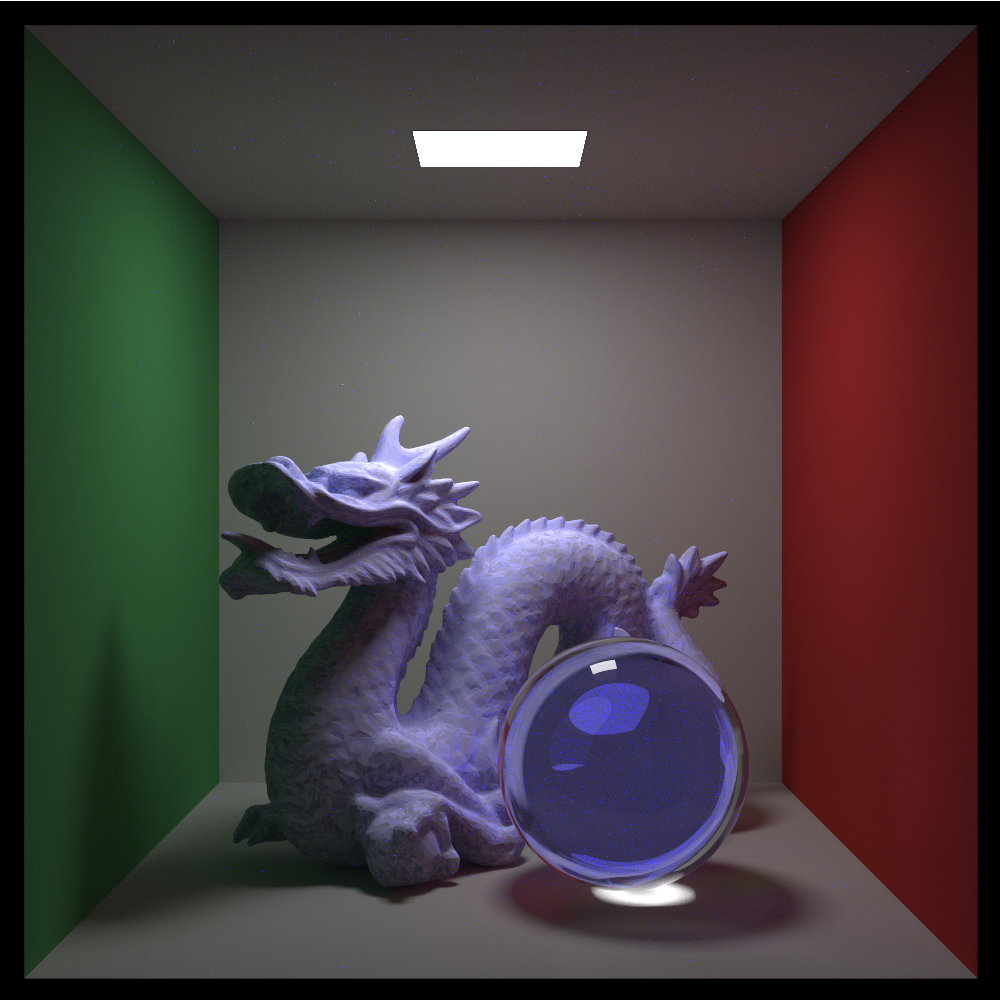

# Izpi

A [path tracer](https://en.wikipedia.org/wiki/Path_tracing) that started life as a Golang implementation of [Peter Shirley's Raytracing books](https://raytracing.github.io). It has since grown in scope and gained more features that were not part of the original version.

## Goals

* Have fun.
* Learn about advanced computer graphics topics and put them to practice.
* Create a well-written and robust renderer that is usable with real world scene workloads. 

## Non-goals

* Write the most performant path tracer possible.
* Build a GPU-based path tracer.
* Integrate with DCC tools.
* Support professional VFX flows. 

## Roadmap

 - [X] Support for [PBR](https://en.wikipedia.org/wiki/Physically_based_rendering) materials.
 - [X] Distributed Rendering.
 - [X] Spectral Sampler to accurately simulate dispersion.
 - [ ] Nested dielectrics.
 - [X] Physically correct light sources library.
 - [ ] Firefly rejection.
 - [ ] Materials library.
 - [ ] Water material.
 - [ ] Sky simulation with day and night support.
 - [ ] Scene conversion tool by implementing Go bindings for [Open Asset Import Library](https://assimp.org).
 - [ ] Implement [Metropolis light transport](https://en.wikipedia.org/wiki/Metropolis_light_transport).

## Features

* Multi-threaded rendering engine.
* Compact scene format using [Protocol Buffers](https://protobuf.dev).
* Automatic worker node discovery via [Zeroconf](https://en.wikipedia.org/wiki/Zero-configuration_networking), with [Avahi](https://en.wikipedia.org/wiki/Avahi_(software)) integration on Linux and FreeBSD hosts.
* Network distributed system using [gRPC](https://grpc.io) and [Protocol Buffers](https://protobuf.dev).
* Spectral rendering with support for dispersion and [Beer-Lambert Law](https://en.wikipedia.org/wiki/Beer–Lambert_law) in dielectric materials.
* Phyisically correct light sources using [SPDs](https://en.wikipedia.org/wiki/Spectral_power_distribution) from [Michael Royer](https://doi.org/10.6084/m9.figshare.7704566.v1) and the [CIE Standard Illuminant](https://en.wikipedia.org/wiki/Standard_illuminant) F-Series.
* Rendering into a float64 image buffer.
* Direct, indirect and image-based lighting.
* Primitives: Spheres, boxes, rectangles and triangles.
* Wavefront OBJ import.
* Built-in materials: Glass, metal, Lambert, Perlin noise.
* Support for [PBR](https://en.wikipedia.org/wiki/Physically_based_rendering) flows with albedo, metalness, roughness, normal and displacement textures.
* Textures: PNG (LDR) and various HDR fromats (OpenEXR, HDR, PFM).
* Resulting images can saved in any format supported by [OpenImageIO](https://openimageio.readthedocs.io).
* Normal mapping.
* Displacement mapping through sub-texel mesh tessellation.

## Gallery

The [Stanford dragon](https://en.wikipedia.org/wiki/Stanford_dragon)

A demonstration of the effect of [displacement mapping](https://en.wikipedia.org/wiki/Displacement_mapping) on a surface using [Bricks078](https://ambientcg.com/view?id=Bricks078) from ambientCG.com, licensed under CC0 1.0 Universal.

A [Cornell box](https://en.wikipedia.org/wiki/Cornell_box) showcasing various [PBR](https://en.wikipedia.org/wiki/Physically_based_rendering) materials from [Free PBR](https://freepbr.com).

A demonstration of the [dispersion](https://en.wikipedia.org/wiki/Dispersion_(optics)) phenomenon calculated by the spectral sampler.

